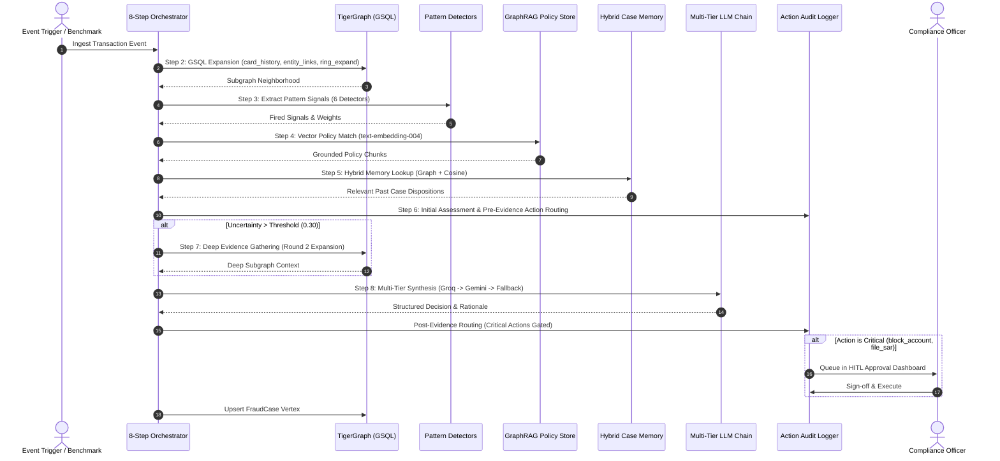
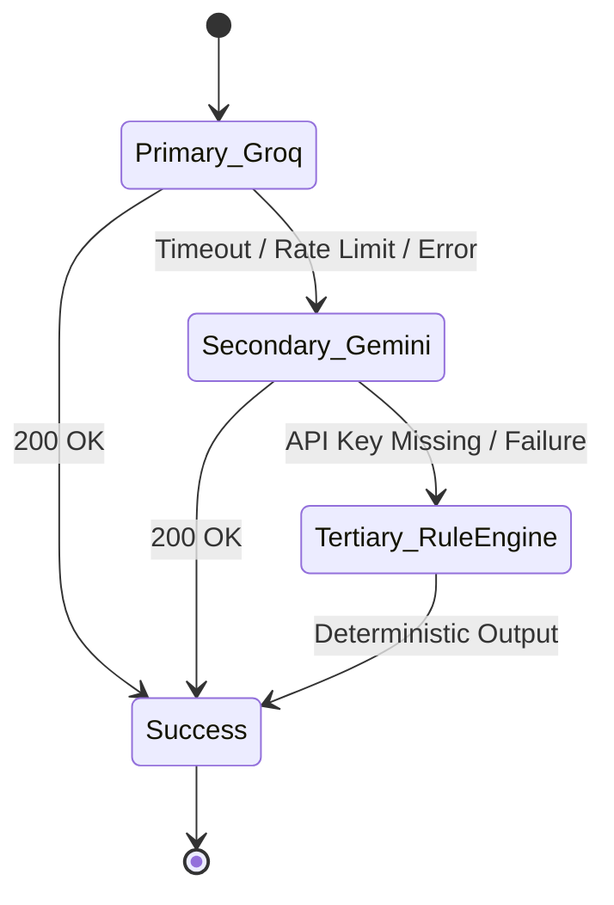

# 🏛️ Technical Architecture & System Design
**TigerGraph Agentic Fraud Investigation (HHGOA)**

---

## 1. 8-Step Autonomous Investigation Lifecycle

---

## 2. Mathematical Scoring Models

### 2.1 Weighted Risk Score
Given a set of fired signals $S = \{s_1, s_2, \dots, s_k\}$, each with severity $\sigma(s_i) \in [0, 100]$ and weight $w(s_i) > 0$:

$$\text{RawRisk}(S) = \frac{\sum_{i=1}^k \sigma(s_i) \cdot w(s_i)}{\sum_{i=1}^k w(s_i)}$$

Historical case memory adjustment with precedent similarity $\text{sim}(c_j)$:

$$\Delta_{\text{mem}} = \sum_{j \in \text{Precedents}} \begin{cases} +10 \cdot \text{sim}(c_j) & \text{if outcome} = \text{confirmed\_fraud} \\ -8 \cdot \text{sim}(c_j) & \text{if outcome} = \text{cleared\_benign} \end{cases}$$

$$\text{RiskScore} = \text{clip}(\text{RawRisk}(S) + \Delta_{\text{mem}}, 5.0, 99.0)$$

### 2.2 Confidence & Uncertainty Formulation
Confidence aggregates signal counts, policy grounding relevance, and iterative verification rounds:

$$\text{Confidence} = \text{clip}\left(0.60 + \min(0.25, |S| \times 0.08) + \min(0.10, |P| \times 0.03) + \mathbb{I}_{\text{round}>1} \times 0.08, 0.40, 0.98\right)$$

Uncertainty is elevated when the decision lies on the classification boundary ($\text{Risk} \approx 50$) or when confidence is depressed:

$$d_{\text{boundary}} = \frac{|\text{RiskScore} - 50.0|}{50.0}$$
$$\text{Uncertainty} = \text{clip}\left((1.0 - \text{Confidence}) \times 0.7 + (1.0 - d_{\text{boundary}}) \times 0.3, 0.05, 0.95\right)$$

---

## 3. Resilient Multi-Tier Circuit Breaker

---

## 4. GSQL Query Specifications

| Query Name | Parameters | Purpose |
| :--- | :--- | :--- |
| `card_history` | `VERTEX<Card> target_card, INT limit_cnt` | Fetches temporal sequence of transactions, devices, IPs, and merchants |
| `entity_links` | `VERTEX<Card> target_card` | Explores 1-hop and 2-hop connected accounts, cards, devices, and IPs |
| `ring_expand` | `VERTEX<Device> seed_device, INT max_depth` | Traverses multi-card sharing rings across shared hardware fingerprints |
| `closed_cases` | `VERTEX<Card> target_card` | Retrieves historical closed cases touching any connected entity in graph |
| `recurring_devices`| `INT min_cards` | Performs community detection for devices shared across $\ge k$ distinct cards |
