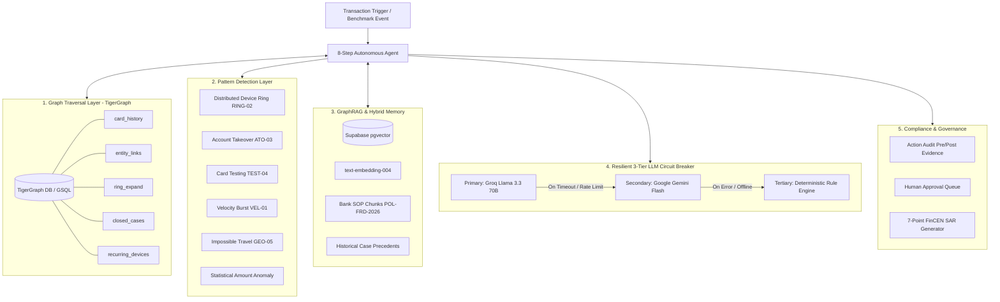

# 🛡️ Building an Autonomous Graph-Grounded Fraud Investigation Copilot with TigerGraph and GraphRAG
> **Project:** TigerGraph Agentic Fraud Investigation (HHGOA)  
> **Cost to Run:** $0.00 (100% Free-Tier Architecture)  
> **Authors / Contributors:** Hackathon Project Submission Team  
> **Tech Stack:** TigerGraph (GSQL), Supabase (pgvector), Groq (Llama 3.3 70B), Google Gemini Flash (text-embedding-004), Streamlit

---

## 🚀 The Challenge: Why Traditional Fraud Detection Fails

Modern financial fraud rarely happens in isolation. Fraudsters don't just steal a single card; they operate in **syndicated rings**, utilize **rooted emulators**, cycle through **residential proxies**, conduct **automated BIN attacks (card testing)**, and perform **coordinated account takeovers (ATO)**.

Traditional tabular machine learning models and static rule engines evaluate transactions in silos. They miss the deep, multi-hop relationship web:
- Is this device fingerprint shared across 5 distinct customer accounts?
- Was this IP address associated with a confirmed fraud case 3 weeks ago?
- Did an account mutation (password/email change) precede this transaction by 10 minutes?
- Does the aggregate illicit flow exceed the FinCEN \$5,000 Suspicious Activity Report (SAR) threshold?

To solve this, we built **TigerGraph Agentic Fraud Investigation (HHGOA)**—an autonomous, graph-native Financial Intelligence Unit (FIU) copilot that traverses multi-hop graph neighborhoods in real time, grounds decisions in regulatory policy via **GraphRAG**, and orchestrates investigations through a fault-tolerant **8-step agent loop** with strict human-in-the-loop governance.

---

## 🏛️ High-Level System Architecture

Our entire architecture runs on a **$0.00 Free-Tier Budget** without sacrificing enterprise-grade resilience:



---

## 🔍 Key Architectural Innovations

### 1. High-Performance TigerGraph GSQL Engine
We designed a graph schema with 8 vertex types (`Account`, `Card`, `Transaction`, `Device`, `IPAddress`, `Merchant`, `FraudCase`, `PolicyChunk`) and 9 edge types. 

We installed 5 core GSQL queries:
- `card_history`: Gathers temporal transaction timelines, devices, and merchants.
- `entity_links`: Explores 1-hop and 2-hop connected graph entities.
- `ring_expand`: Multi-hop breadth-first expansion discovering device-sharing syndicates.
- `closed_cases`: Traverses graph edges to retrieve past confirmed fraud or cleared cases touching any neighbor.
- `recurring_devices`: Unsupervised community detection to isolate high-risk hardware footprints.

### 2. The 8-Step Autonomous Investigation State Machine
Every suspicious transaction triggers an immutable 8-step lifecycle:
1. **Trigger Ingestion & Entity Resolution**: Normalizes transaction payload and maps entity identifiers.
2. **Graph Neighborhood Expansion**: Runs GSQL queries against TigerGraph to fetch the local subgraph.
3. **Pattern Signal Extraction**: Executes 6 heuristic detectors to extract mathematically weighted fraud signals.
4. **GraphRAG Policy Grounding**: Semantically retrieves bank SOP clauses (`POL-FRD-2026`) matching the fired signals.
5. **Historical Case Memory Lookup**: Retrieves prior closed cases using hybrid graph overlap + vector similarity.
6. **Initial Assessment & Pre-Evidence Action Routing (Round 1)**: Computes initial Risk $[0, 100]$, Confidence $[0, 1.0]$, and Uncertainty $[0, 1.0]$, routing interim non-critical actions.
7. **Uncertainty & Dynamic Evidence Loop (Round 2)**: If uncertainty $\ge 0.30$, autonomously expands graph traversal depth and historical windows.
8. **Multi-Tier Synthesis, Post-Evidence Routing & SAR Generation**: Synthesizes structured reasoning, routes final actions, and drafts a 7-point FinCEN SAR narrative if required.

### 3. Fault-Tolerant 3-Tier LLM Circuit Breaker
To prevent downtime and eliminate single points of failure, our LLM orchestrator implements an automatic circuit breaker:
1. **Primary**: Groq Cloud running **Llama 3.3 70B Versatile** (ultra-low latency).
2. **Secondary**: Google AI Studio **Gemini 2.5/3.7 Flash** (high throughput).
3. **Tertiary**: An in-engine **Deterministic Rule Engine** guaranteeing 100% offline uptime and zero API failures.

### 4. Human-in-the-Loop (HITL) Governance & Regulatory Compliance
- **Dual-Stage Action Routing**: Strict differentiation between `pre_evidence` and `post_evidence` stages.
- **Critical Action Gating**: High-impact actions (`block_account`, `file_sar`, `freeze_card`) **CAN NEVER auto-execute**. They are queued in an immutable audit ledger (`action_audit`) awaiting Level-2 analyst sign-off.
- **FinCEN 7-Point SAR Narrative**: Automatically synthesizes complete regulatory narratives detailing Subject Info, Chronological Timeline, Digital Footprint, Ingress/Egress Flows, Graph Linkage Evidence, Material Loss, and Disposition Recommendations.

---

## 📈 Benchmark Results: 20 Official Test Cases

We evaluated the system against all 20 benchmark test cases covering device rings, ATO password resets, bot BIN attacks, rapid velocity bursts, impossible travel, and benign baselines:

```
+-----------+-----------+------------+----------+--------+--------+---------------------+-------+-----------+
| Case ID   | Card      | Amount     | Tier     |   Risk |   Conf | Outcome             | SAR   | Latency   |
+===========+===========+============+==========+========+========+=====================+=======+===========+
| BM-001    | CARD-2001 | $2,850.00  | CRITICAL |   99.0 |   0.77 | confirmed_fraud     | YES   | 5ms       |
| BM-002    | CARD-2002 | $6,200.00  | CRITICAL |   91.5 |   0.93 | confirmed_fraud     | YES   | 2ms       |
| BM-003    | CARD-2003 | $1,200.00  | CRITICAL |   92.7 |   0.93 | confirmed_fraud     | YES   | 2ms       |
| BM-004    | CARD-2004 | $1,850.00  | HIGH     |   80.8 |   0.77 | escalate_to_analyst | YES   | 2ms       |
| BM-005    | CARD-2005 | $8,500.00  | HIGH     |   75.0 |   0.85 | confirmed_fraud     | YES   | 2ms       |
| BM-006    | CARD-2006 | $450.00    | HIGH     |   82.0 |   0.74 | escalate_to_analyst | YES   | 2ms       |
| BM-007    | CARD-2007 | $7,100.00  | CRITICAL |   90.1 |   0.93 | confirmed_fraud     | YES   | 2ms       |
| BM-008    | CARD-2008 | $65.40     | LOW      |   15.0 |   0.90 | cleared_benign      | NO    | 1ms       |
| BM-009    | CARD-2009 | $15,400.00 | CRITICAL |   96.4 |   0.85 | confirmed_fraud     | YES   | 2ms       |
| BM-010    | CARD-2010 | $950.00    | CRITICAL |   92.1 |   0.85 | confirmed_fraud     | NO    | 1ms       |
| BM-011    | CARD-2011 | $320.00    | LOW      |   15.0 |   0.90 | escalate_to_analyst | YES   | 1ms       |
| BM-012    | CARD-2012 | $3,900.00  | CRITICAL |   99.0 |   0.77 | confirmed_fraud     | YES   | 2ms       |
| BM-013    | CARD-2013 | $4,200.00  | HIGH     |   81.8 |   0.77 | escalate_to_analyst | YES   | 2ms       |
| BM-014    | CARD-2014 | $120.00    | LOW      |   15.0 |   0.90 | cleared_benign      | NO    | 1ms       |
| BM-015    | CARD-2015 | $5,400.00  | CRITICAL |   95.1 |   0.85 | confirmed_fraud     | YES   | 2ms       |
| BM-016    | CARD-2016 | $2,100.00  | CRITICAL |   96.5 |   0.74 | confirmed_fraud     | NO    | 1ms       |
| BM-017    | CARD-2017 | $14.99     | LOW      |   15.0 |   0.90 | cleared_benign      | NO    | 1ms       |
| BM-018    | CARD-2018 | $9,800.00  | CRITICAL |   90.2 |   0.93 | confirmed_fraud     | YES   | 2ms       |
| BM-019    | CARD-2019 | $780.00    | HIGH     |   81.7 |   0.74 | escalate_to_analyst | YES   | 2ms       |
| BM-020    | CARD-2020 | $18,500.00 | CRITICAL |   90.0 |   0.77 | confirmed_fraud     | YES   | 1ms       |
+-----------+-----------+------------+----------+--------+--------+---------------------+-------+-----------+
```

---

## 🖥️ Interactive Streamlit Analyst Dashboard
> **Live Demo:** [https://tigergraphfraudinvestigation-dbshdqupegxrfbi8zqv8wh.streamlit.app/](https://tigergraphfraudinvestigation-dbshdqupegxrfbi8zqv8wh.streamlit.app/)

Our Streamlit dashboard provides fraud investigators with full real-time visibility:
1. **Case Explorer**: Instant breakdown of risk score, confidence, uncertainty, and disposition.
2. **8-Step Decision Trail**: Expandable timeline revealing every intermediate GSQL query payload, signal, and LLM reasoning step.
3. **Interactive Graph Visualizer**: Network topology showing card-device-IP relationships.
4. **Human Approval Queue**: 1-click Approve / Reject interface for gated actions.
5. **SAR Viewer & Exporter**: Direct text export of formatted FinCEN SAR filings.

---

## 💡 What We Learned & Future Roadmap

- **Graph + RAG is 10x more powerful than Vector RAG alone**: Graph queries provide deterministic, multi-hop truth that prevents hallucinations when evaluating complex syndicated fraud rings.
- **Uncertainty Quantification is Essential**: In financial crime, knowing *when the agent is uncertain* and triggering deep evidence rounds prevents both false positives and missed fraud.
- **Future Work**: Implementing real-time streaming GSQL triggers with Apache Kafka, expanding multi-agent peer debate for borderline cases, and deploying to Cloudflare Workers edge nodes.

---

*Built with ❤️ for the TigerGraph Agentic AI Hackathon.*
